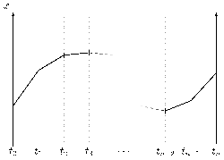

# Path Integral solver for a Quantum Mechanical Harmonic Oscillator

A small program which solves the quantum mechanical path integral based. Serves as a conceptual stepping stone to Lattice methods. Based on task in [this paper](https://arxiv.org/abs/hep-lat/0506036).

<!-- <p align="center">
    
</p> -->


<p align="center">
    <i>An illustration of the path integral. We discretize in the path into different time slices, and then perform a numerical integral at each slice.</i>
</p>

### How-to run
```
cd build
qmake ../QMPathIntegralSolver
make
./QMPathIntegralSolver
```